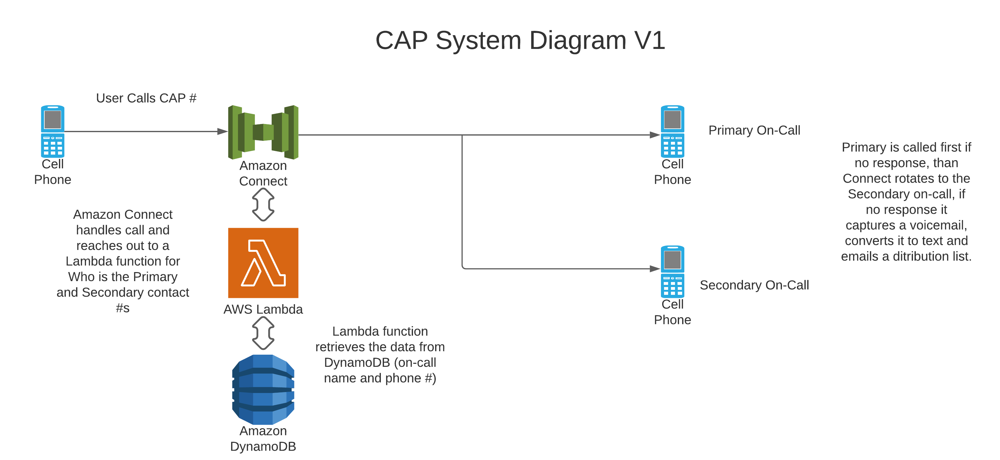
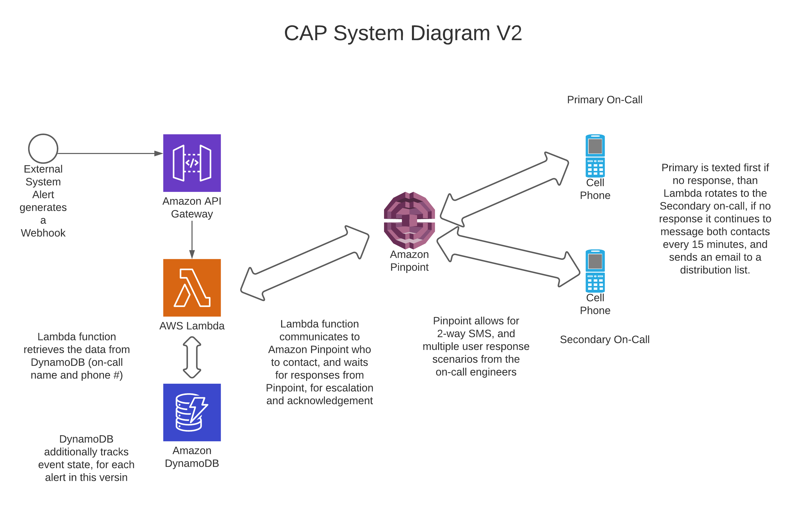

# CAP   
### Call Alert at Pluribus
____
#### Design Goal: 
* This system is designed as a lightweight, and modular tool for connecting agnostic monitoring, alerting, and future frameworks to be able to contact engineers and reporting chains via SMS and Phone Call.

* **V1**: This version provided a generic phone number that connects requestor to primary and secondary on-call contacts if there is an emergency.

    * [Amazon Connect](https://aws.amazon.com/connect/)
        * This is AWS' Call Center in a box which allows for visual workflows using an IVR
    * [AWS Lambda (Python)](https://docs.aws.amazon.com/lambda/latest/dg/lambda-python.html)
        * Triggered by API Gateway or Pinpoint to pull contact info, and initiate response logic.
    * [Amazon DynamoDB](https://aws.amazon.com/dynamodb/)
        * Provides lightweight holding and access of engineer information, and on-call state (primary, escalation, off).
* **V2**: Building off the first version, this provides a system that draws in automated alerts from systems, and routes those alerts to engineers via SMS.

    * [Amazon Pinpoint](https://aws.amazon.com/pinpoint/)
        * 2 Way SMS - allows engineers to receive and acknowledge alerts.
    * [Amazon API Gateway](https://aws.amazon.com/api-gateway/)
        * Provides logic handling for inbound and outbound requests to external tooling.
    * [Amazon DynamoDB](https://aws.amazon.com/dynamodb/)
        * Provides lightweight holding and access of engineer information, and on-call state (primary, escalation, off).
    * [AWS Lambda (Python)](https://docs.aws.amazon.com/lambda/latest/dg/lambda-python.html)
        * Triggered by API Gateway or Pinpoint to pull contact info, and initiate response logic.
    * [Webhooks](https://en.wikipedia.org/wiki/Webhook)
        * Open web technology used as part of external system to our API gateway.
        * Works with Microsoft Teams, Splunk, New Relic and others.
* **Future State**: provide a system that can handle SMS and calling of engineers, and activation via phone or automated alerts.
