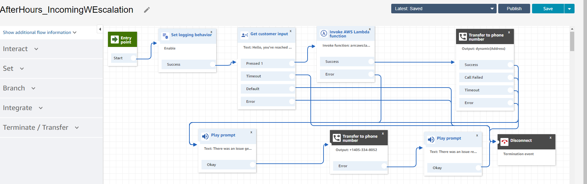

# CAP Connect Setup  
### Call Alert at Pluribus
____
### Connect Setup
1. Follow [basic setup instructions here](https://docs.aws.amazon.com/connect/latest/adminguide/tutorial1-set-up-your-instance.html), to create a call center, and claim a phone number.
2. Once you've set up Connect, you'll need to configure a Call Flow.
    - [Full Connect Flow Documentation](https://docs.aws.amazon.com/connect/latest/adminguide/connect-contact-flows.html)
3. You can import our [After Hour flow via this json file](AfterHours_IncomingWEscalation.json)
    - Right Click and Save As for the above file
    - Create a new blank Call Flow
    - Next to Save, press the drop down icon on the right side of the screen
    - Choose Import Flow, and follow the prompts on screen
    - 
4. After setting up the above After Hours call flow refer to the [Lambda Setup](lambda.md) for next steps!