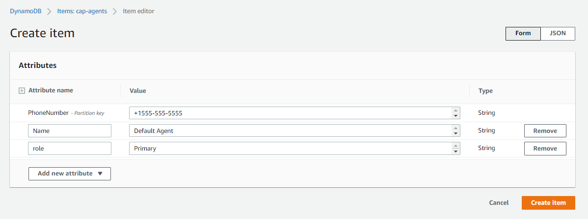

# CAP Connect Setup  
### Call Alert at Pluribus
____
### DynamoDB Setup
1. Navigate to [AWS Console and choose the DynamoDB service page](https://console.aws.amazon.com/dynamodbv2/home?region=us-east-1#tables)
2. Choose Tables
3. Create a new Table
4. Name the table
    - ex: cap-agents
5. Give a partition key
    - Needs to be one of 3 values, Name, PhoneNumber or Role
    - Choose PhoneNumber as it is the most unique
    - PhoneNumber will now be a required value for all entries
6. Leave remaining settings at their default, unless your organization require tags.
7. Click Create Table.
8. Once the table has been created we will add our first value
9. Click the table
10. Click View Items
11. Choose Create Item
12. For PhoneNumber put your phone in the format +1AreaCode-First3-Last4
    - Example: +1555-555-5555
    - All phone numbers need to be in the above format
13. Click Add new attribute
    - Choose String, and set the attribute to Name
    - This value can be a free string, and can have spaces, and dashes as needed
    - ex Default Agent
14. Click Add new attribute
    - Choose String, and set the attribute to role
    - This value will have a one word, no spaces, and dashes
    - ex Primary
    - 
15. Click Create Item
16. Your DynamoDB is now ready to be used, and you can test that everything is working by calling the phone number you created in the [Connect Setup.](connect_setup.md)
