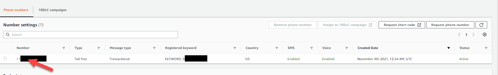
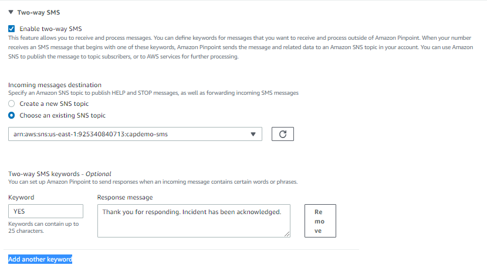

# CAP Connect Setup  
### Call Alert at Pluribus
____
### Connect Setup
1. Follow [basic setup instructions here](https://docs.aws.amazon.com/pinpoint/latest/developerguide/tutorials-two-way-sms-part-1.html), to create a Pinpoint project, and claim a phone number.
2. Once you've set up Pinpoint, you'll need to configure the settings for SMS.
    - Click Settings -> SMS and Voice from the lefthand sidebar
    - Click the highlighted phone number you've created
        - Note this should have been a Toll Free number, for message type Transactional
        - 
3. From here we'll enable Two-way SMS and add our first custom keyword.
    - Checkbox Enable Two-Way SMS
    - Either create a new SNS Topic for this project or Choose an existing one.
    - Add a new keyword
        - For this demo, we use YES, and a sample response message of "Thank you for responding. Incident has been acknowledged."
    - 